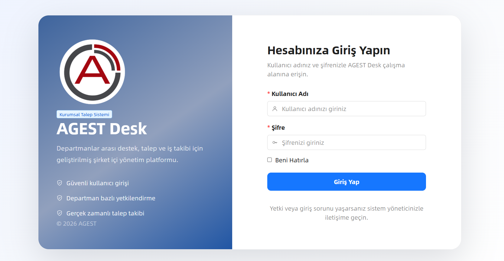
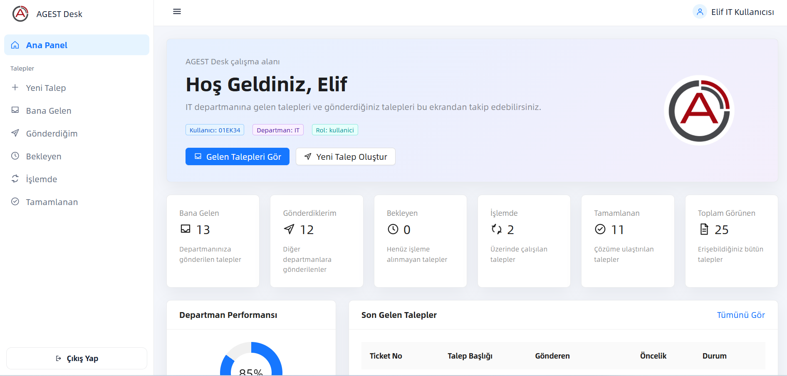
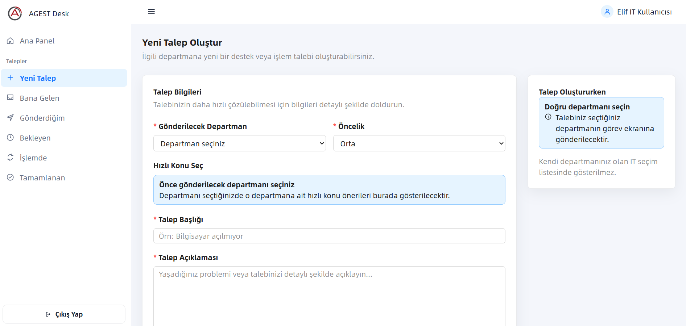

<p align="center">
  
</p>

<h1 align="center">AGEST Desk</h1>

<p align="center">
  Kurumsal Help Desk & Ticket Yönetim Sistemi
</p>

<p align="center">
  React • TypeScript • Node.js • Express • MySQL
</p>

---

# AGEST Desk

AGEST Desk, şirket içerisindeki departmanlar arasında teknik ve operasyonel taleplerin oluşturulması, takip edilmesi ve yönetilmesi amacıyla geliştirilmiş kurumsal bir **Help Desk (Ticket Management)** uygulamasıdır.

Sistem; rol bazlı yetkilendirme, departman yönetimi, talep yaşam döngüsü, öncelik sistemi ve e-posta bildirimleri gibi kurumsal ihtiyaçları karşılayacak şekilde tasarlanmıştır.

---

# 📸 Ekran Görüntüleri

### 🔐 Giriş Ekranı

Kullanıcı adı ve şifre ile güvenli giriş ekranı.



---

### 📊 Dashboard

Kullanıcının sistem özetini, istatistiklerini ve son işlemlerini görüntüleyebildiği ana panel.



---

### 🎫 Talep Yönetimi

Yeni talep oluşturma, gelen ve gönderilen taleplerin yönetildiği ekran.



---

# 🚀 Özellikler

- JWT Authentication
- Güvenli kullanıcı girişi
- Rol bazlı yetkilendirme
- Departman bazlı talep yönetimi
- Öncelik sistemi (Düşük / Orta / Yüksek / Kritik)
- Otomatik Ticket numarası oluşturma
- Talep durum yönetimi
  - Bekliyor
  - İşlemde
  - Tamamlandı
- Durum geri alma işlemleri
- Dashboard ve istatistik ekranları
- Kullanıcı Yönetimi
- Departman Yönetimi
- Gelen Talepler
- Gönderilen Talepler
- Dosya ekleme desteği
- Otomatik e-posta bildirimleri
- Responsive arayüz

---

# 🏗️ Mimari

Proje geliştirme sürecinde tamamen yeniden yapılandırılmıştır.

Yapılan başlıca iyileştirmeler:

- Ant Design ve Ant Design Pro bağımlılıkları tamamen kaldırıldı.
- Özel React + TypeScript tabanlı UI bileşenleri geliştirildi.
- Özel Layout sistemi oluşturuldu.
- Dashboard, tablolar, formlar ve modal yapıları yeniden geliştirildi.
- Tek açık tema mimarisi oluşturuldu.
- Kod tabanı sadeleştirildi ve gereksiz template dosyaları temizlendi.

---

# 🛠️ Kullanılan Teknolojiler

## Frontend

- React
- TypeScript
- Umi Max
- Custom UI Library
- Custom Layout
- CSS

## Backend

- Node.js
- Express.js
- JWT Authentication
- Nodemailer

## Database

- MySQL

---

# 📁 Proje Yapısı

```text
help-desk
│
├── backend
│   ├── server.js
│   ├── db.js
│   ├── authMiddleware.js
│   ├── mailService.js
│   └── package.json
│
├── database
│   └── help_desk.sql
│
├── public
├── src
├── package.json
└── README.md
```

---

# ⚙️ Kurulum

## 1. Projeyi Klonlayın

```bash
git clone https://github.com/elif-ks/agest-desk.git
```

---

## 2. Frontend

```bash
npm install
npm start
```

---

## 3. Backend

```bash
cd backend

npm install

node server.js
```

---

## 4. Veritabanı

`database` klasörü içerisindeki

```text
help_desk.sql
```

dosyasını phpMyAdmin üzerinden içe aktarın.

---

## 5. Ortam Değişkenleri

Backend klasörü içerisine `.env` dosyası oluşturun.

Örnek:

```env
PORT=5000

DB_HOST=localhost
DB_USER=root
DB_PASSWORD=
DB_NAME=help_desk

JWT_SECRET=ornek_jwt_anahtari

MAIL_USER=mail@gmail.com
MAIL_PASSWORD=google_uygulama_parolasi
```

---

# 🔄 Talep Durum Akışı

```text
Bekliyor
     │
     ▼
 İşlemde
     │
     ▼
Tamamlandı

İşlemde → Bekliyor

Tamamlandı → İşlemde
```

---

# 👨‍💻 Geliştirici

**Elif Karakuş**

GitHub: https://github.com/elif-ks

---

# 📄 Lisans

Bu proje eğitim, staj ve portföy amacıyla geliştirilmiştir.